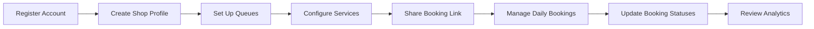

# 🏪 ShopQueue - Smart Booking & Customer Queue System

> **A comprehensive SaaS solution for small shops to manage customer queues, appointments, and walk-ins with real-time updates and SMS notifications.**

---

## 📋 Project Overview

| **Project Type** | SaaS Application |
|---|---|
| **Target Market** | Small Shops (Barbershops, Salons, Repair Shops, Clinics) |
| **Status** | ✅ Complete & Ready for Production |
| **Tech Stack** | MERN Stack + Socket.io + Twilio |
| **License** | MIT |

### 🎯 **Core Value Proposition**
Transform traditional queue management with modern technology - no more frustrated customers waiting without knowing how long, better time management for shop owners, and improved customer experience through remote booking.

---

## 🚀 Key Features

### 📱 **Customer Features**
- [x] **Online Booking** - Custom branded booking pages
- [x] **Real-time Status** - Live queue position tracking
- [x] **SMS Notifications** - Automated booking confirmations and alerts
- [x] **Feedback System** - Post-service rating and reviews

### 🏪 **Shop Owner Features**
- [x] **Multi-shop Management** - Manage multiple locations
- [x] **Queue Customization** - Set capacity, service times, descriptions
- [x] **Booking Management** - Update statuses, manage walk-ins
- [x] **Analytics Dashboard** - Track performance, peak hours, customer satisfaction
- [x] **Real-time Display** - Live queue display for in-shop monitors

### 🔧 **Technical Features**
- [x] **Real-time Updates** - WebSocket integration for instant updates
- [x] **SMS Integration** - Twilio-powered notifications
- [x] **Responsive Design** - Mobile-first approach
- [x] **Secure Authentication** - JWT-based auth with role management
- [x] **Automated Jobs** - Cron-based reminder system

---

## 💰 Business Model

### 📊 **Subscription Tiers**

| Plan | Price | Features |
|------|-------|----------|
| **Free** | $0/month | • 1 queue<br>• 50 bookings/month<br>• Basic features |
| **Standard** | $10/month | • 3 queues<br>• SMS notifications<br>• Custom branding<br>• Basic analytics |
| **Pro** | $30/month | • Unlimited queues<br>• Advanced analytics<br>• Team access<br>• Priority support |

### 🎯 **Target Customers**
- Barbershops & Hair Salons
- Tailors & Alteration Services
- Phone/Laptop Repair Shops
- Small Clinics & Dental Offices
- Custom Print & Embroidery Shops
- Cafes with Limited Seating

---

## 🛠️ Technical Architecture

### **Tech Stack**

| Layer | Technology | Purpose |
|-------|------------|---------|
| **Frontend** | React 18 + Tailwind CSS | User interface & styling |
| **Backend** | Node.js + Express | REST API server |
| **Database** | MongoDB + Mongoose | Data persistence |
| **Real-time** | Socket.io | Live updates |
| **Notifications** | Twilio | SMS/WhatsApp messaging |
| **Authentication** | JWT | Secure user sessions |

### **Key Components**

```
📁 ShopQueue/
├── 📁 server/           # Backend API
│   ├── 📁 models/       # Database schemas
│   ├── 📁 routes/       # API endpoints
│   ├── 📁 middleware/   # Auth & validation
│   ├── 📁 utils/        # Notifications & helpers
│   └── 📁 jobs/         # Automated tasks
├── 📁 client/           # React frontend
│   ├── 📁 src/
│   │   ├── 📁 pages/    # Route components
│   │   ├── 📁 components/ # Reusable UI
│   │   ├── 📁 contexts/ # State management
│   │   └── 📁 utils/    # API calls
│   └── 📁 public/       # Static assets
└── 📄 README.md         # Documentation
```

---

## 🗄️ Database Design

### **Core Entities**

**👤 Users**
- Authentication & profile data
- Role-based access (shop_owner/customer)
- Shop associations

**🏪 Shops**
- Business information & branding
- Operating hours & services
- Subscription management
- Address & contact details

**📋 Queues**
- Queue configuration (capacity, service time)
- Shop association
- Active/inactive status

**📝 Bookings**
- Customer information
- Queue assignment & position
- Status tracking (pending → confirmed → in_progress → completed)
- Service details & timestamps

**⭐ Feedback**
- Multi-dimensional ratings (overall, service, wait time)
- Comments & recommendations
- Booking association

---

## 🎨 User Experience

### **Customer Journey**

```mermaid
graph LR
    A[Discover Shop] --> B[Visit Booking Page]
    B --> C[Fill Details & Select Service]
    C --> D[Choose Queue]
    D --> E[Receive SMS Confirmation]
    E --> F[Track Status Online]
    F --> G[Get 'Almost Your Turn' Alert]
    G --> H[Service Completion]
    H --> I[Feedback Request]
```



### **Shop Owner Journey**



---

## 📊 Key Metrics & Analytics

### **Dashboard Metrics**
- **📈 Total Bookings** - Daily/weekly/monthly booking counts
- **✅ Completion Rate** - Percentage of successful service completions
- **⏱️ Average Wait Time** - Customer wait time tracking
- **⭐ Customer Rating** - Average satisfaction scores
- **📅 Peak Hours** - Busiest time identification
- **🚫 No-show Rate** - Customer reliability metrics

### **Business Intelligence**
- Booking trends over time
- Service popularity analysis
- Customer retention insights
- Revenue optimization opportunities

---

## 🚀 Deployment & Production

### **Environment Setup**

```bash
# Clone repository
git clone <repository-url>
cd ShopQueue

# Install dependencies
npm run install:all

# Configure environment
cp .env.example .env
# Edit .env with your configurations

# Start development
npm run dev
```

### **Required Services**
- **MongoDB** - Database (local or MongoDB Atlas)
- **Twilio Account** - SMS notifications
- **Domain & Hosting** - Production deployment

### **Production Checklist**
- [x] Environment variables configured
- [x] Database indexes optimized
- [x] Security headers implemented
- [x] Rate limiting enabled
- [x] Error logging setup
- [x] SSL certificate configured
- [x] Backup strategy defined

---

## 📈 Growth Strategy

### **Phase 1: MVP Launch** ✅
- Core booking & queue management
- Basic SMS notifications
- Simple analytics dashboard
- Free & paid tiers

### **Phase 2: Enhanced Features** 🔄
- [ ] WhatsApp Business integration
- [ ] QR code generation
- [ ] Advanced analytics
- [ ] Mobile app (React Native)

### **Phase 3: Scale & Enterprise** 📋
- [ ] Multi-language support
- [ ] Advanced team management
- [ ] API for third-party integrations
- [ ] Enterprise custom solutions

---

## 💡 Innovation Opportunities

### **Potential Enhancements**
- **🤖 AI-powered wait time prediction** - Machine learning for accurate estimates
- **📱 Progressive Web App** - Offline functionality
- **🔗 POS Integration** - Connect with existing payment systems
- **📊 Advanced Reporting** - Custom report generation
- **🌍 Multi-tenant SaaS** - White-label solutions for agencies

### **Market Expansion**
- International markets with localization
- Franchise management features
- Industry-specific customizations
- Government & public sector applications

---

## 🔧 Development Notes

### **Setup Instructions**
1. **Prerequisites**: Node.js 16+, MongoDB, Twilio account
2. **Installation**: Run `npm run install:all`
3. **Configuration**: Update `.env` with database and Twilio credentials
4. **Development**: Use `npm run dev` for concurrent front/backend
5. **Production**: Build with `npm run build` and deploy

### **Key Files**
- `server/index.js` - Main server entry point
- `client/src/App.js` - React application root
- `server/models/` - Database schemas
- `client/src/pages/` - Main application pages

### **Testing Accounts**
- Shop Owner: Create via `/register` with role "shop_owner"
- Customer: Any booking creates customer data
- Demo Shop: Available after first shop creation

---

## 📞 Contact & Support

### **Repository Information**
- **GitHub**: [ShopQueue Repository]
- **Documentation**: Complete README.md included
- **License**: MIT License

### **Technical Support**
- Comprehensive setup documentation provided
- Code comments and inline documentation
- Modular architecture for easy customization

---

*Built with ❤️ for small businesses everywhere*

**Last Updated**: [Current Date]
**Version**: 1.0.0
**Status**: Production Ready ✅